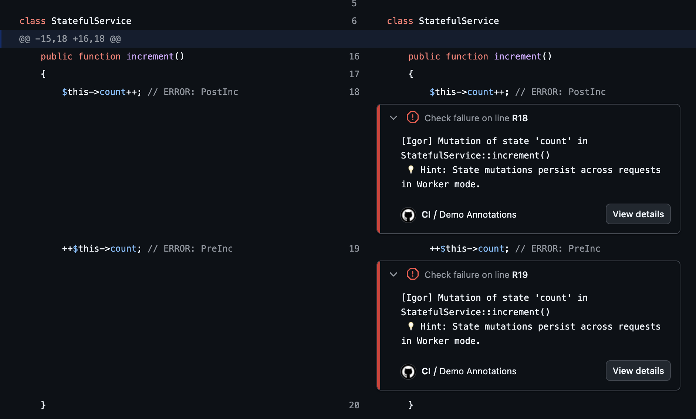

# 🧟‍♂️⚡ Igor-Php 
<p align="center">
  
</p>

**The faithful assistant for your FrankenPHP Workers.**

`igor-php` is an ultra-fast static linter written in **Go** that prepares your **Symfony** application for the persistent memory model of **FrankenPHP**.

Like the legendary assistant, `igor` checks every connection and part of your application to ensure it won't "blow up" when the lightning strikes (Worker Mode).

---

## ✨ Highlights

- **⚡ Lightning Fast**: Scans hundreds of files in milliseconds using Go's native multi-threading.
- **🔍 Deep Audit**: Automatically detects Symfony projects and audits **every shared service** defined in the container, including those in `vendor/` and external bundles.
- **🎯 Surgical Precision**: Detects complex state mutations (`$this->prop[]`, `static::$prop`, increments) without false positives.
- **🧠 Intelligent**: Verifies not just the presence of `ResetInterface`, but ensures all mutated properties are correctly reset. Automatically ignores **`readonly` properties and classes** (PHP 8.1+) as they are immutable by design.
- **🛡️ Safety First**: Catches dangerous `exit()` or `die()` calls, and warns about **PHP Superglobals** (`$_GET`, `$_POST`, etc.) or **local static variables** that could leak state between requests.
- **🔇 Zero Noise**: Automatically ignores `Symfony\` and `Doctrine\` namespaces, and common data folders (`Entity`, `Dto`, `ApiResource`).
- **🎯 Selective Ignore**: Skip specific lines using the `// @igor-ignore` comment.

---

## 📋 Prerequisites

- **Go**: Required to compile or install the binary.
- **PHP 8.1+**: Required for the **Deep Audit** mode. Igor uses PHP Reflection to precisely locate service files within your project and `vendor/` directory. Without PHP, Igor will fall back to a standard directory scan.

---

## 🚀 Installation

### Via Composer (Recommended)
```bash
composer require --dev igor-php/igor-php
```

### Via Go
```bash
go install github.com/igor-php/igor-php@latest
```

---

## 🛠️ Usage

### 🪄 Quick Start
Igor can automatically detect your project type Symfony and generate a default configuration for you:

```bash
# Initialize igor.json
igor-php init
```

### 🔍 Audit your project
Once initialized (or using defaults), let Igor audit your project:

```bash
# Standard usage
igor-php .

# Custom console path, environment and verbose mode
igor-php --console app/console --env stage --verbose .
```

### Deep Audit Mode (Symfony)
When a Symfony project is detected, Igor will:
1. Query the container in the configured environment (`--env=prod --no-debug` by default).
2. Map every **shared service** to its actual source file via PHP Reflection.
3. Perform an exhaustive audit of your code and all its dependencies.

### Example Output
```text
📂 src/Service/MyService.php
  ❌ Mutation of state 'cache' in MyService::getData().
  42 | $this->cache = $result;

⚠️  Property 'tempData' of MyService is mutated but not reset in reset().
  💡 Hint: Add '$this->tempData = null;' in the reset() method.
```

---

## ⚙️ Configuration

You can customize Igor's behavior by creating an `igor.json` file at the root of your project:

```json
{
  "exclude": ["vendor", "tests", "Entity"],
  "safe_namespaces": ["Symfony\\", "Doctrine\\", "My\\Safe\\Namespace\\"],
  "console_path": "bin/console",
  "env": "prod",
  "verbose": false
}
```

- **exclude**: List of directories to skip during indexing.
- **safe_namespaces**: Igor will ignore state mutations in classes starting with these prefixes.
- **console_path**: Custom path to the Symfony console binary. Defaults to `bin/console`.
- **env**: Symfony environment to use for container analysis. Defaults to `prod`.
- **verbose**: Enable verbose output to see skipped services and reasons. Defaults to `false`.

### Selective Ignoring

If you have a specific line that you know is safe, you can use the `// @igor-ignore` annotation:

```php
// @igor-ignore
$this->cache = $data; // This line will be ignored

$this->counter++; // @igor-ignore - This line too
```

---

## 🔍 Understanding Deep Audit Filtering

When using the **Deep Audit** mode (Symfony), Igor might analyze fewer services than your total container count. Use the `--verbose` flag to see exactly why a service was skipped. Common reasons include:

- **🔄 Duplicate File**: Multiple Service IDs (aliases, locators, etc.) pointing to the same PHP file. Igor only audits each unique file once.
- **♻️ Non-shared (Prototype)**: Services marked as `shared: false` are recreated on every request and don't persist state between workers. They are safe by design.
- **λ Closures / Synthetic**: Services that don't map to a physical PHP class (like Closures or synthetic services) cannot be statically analyzed.
- **🛡️ Safe Namespace**: The class belongs to a namespace defined in `safe_namespaces` (like `Symfony\` or `Doctrine\`).

---

## 🤖 CI/CD Integration

Igor is designed to work out-of-the-box in your CI pipelines. It will exit with **code 1** if any error is found, effectively stopping your build.

### GitHub Actions support
When running inside GitHub Actions, Igor automatically generates **inline annotations**. This means errors will appear directly in your Pull Request review, right next to the code causing the issue.

<p align="center">
  
</p>

### GitHub Actions Example

```yaml
name: Static Analysis
on: [push, pull_request]

jobs:
  igor:
    runs-on: ubuntu-latest
    steps:
      - uses: actions/checkout@v4

      - name: Setup PHP
        uses: shivammathur/setup-php@v2
        with:
          php-version: '8.2'

      - name: Install Dependencies
        run: composer install --no-progress --prefer-dist

      - name: Setup Go
        uses: actions/setup-go@v5
        with:
          go-version: '1.23'

      - name: Run Igor
        run: |
          go install github.com/igor-php/igor-php@latest
          igor-php .
```

---

## 🙏 Credits & Inspirations

- **[Phanalist](https://github.com/denzyldick/phanalist)**: Special thanks to `phanalist` and its rule `E0012` (Stateful Service) which inspired Igor's core mutation detection logic.
- **[Gemini CLI](https://github.com/google/gemini-cli)**: This project was built with the help of Gemini CLI.
- **[FrankenPHP](https://frankenphp.dev/)**: For the amazing server that makes these checks necessary!

---

## 📄 License
MIT
