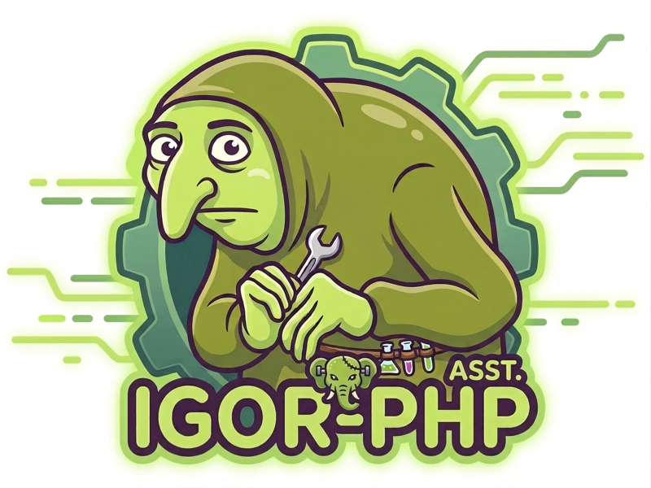
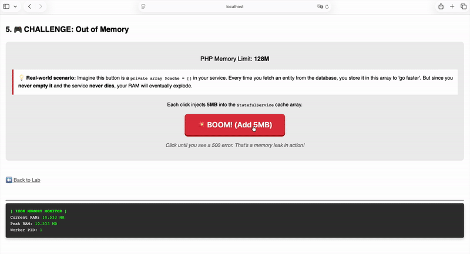
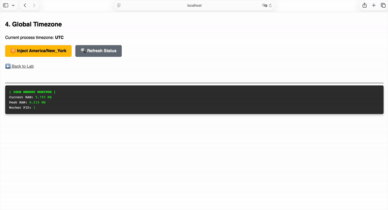
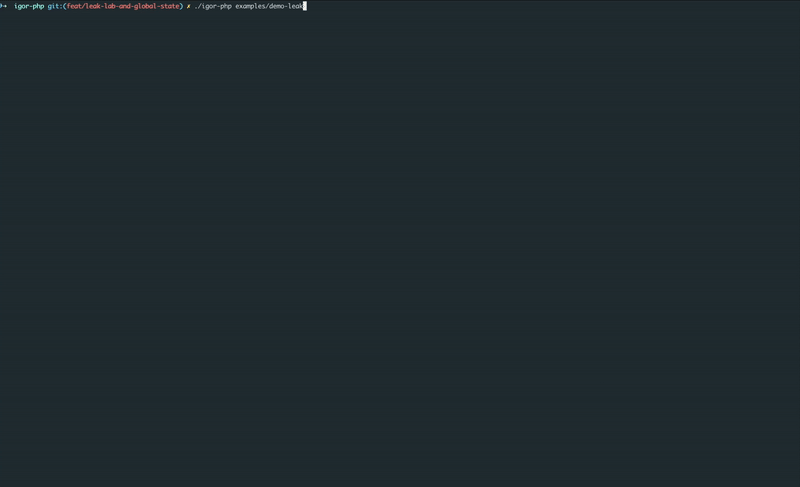

# 🧟‍♂️⚡ Igor-Php 
<p align="center">
  
</p>

**The faithful assistant for your FrankenPHP Workers.**

`igor-php` is an ultra-fast static linter written in **Go** that prepares your **Symfony** application for the persistent memory model of **FrankenPHP**.

Like the legendary assistant, `igor` checks every connection and part of your application to ensure it won't "blow up" when the lightning strikes (Worker Mode).

---

## ✨ Highlights

- **⚡ Lightning Fast**: Scans hundreds of files in milliseconds using Go's native multi-threading.
- **🔍 Deep Audit**: Automatically detects Symfony projects and audits **every shared service** defined in the container, including those in `vendor/` and external bundles.
- **🎯 Surgical Precision**: Detects complex state mutations (`$this->prop[]`, `static::$prop`, increments) without false positives.
- **🧠 Intelligent**: Verifies not just the presence of `ResetInterface`, but ensures all mutated properties are correctly reset. Automatically ignores **`readonly` properties and classes** (PHP 8.1+) as they are immutable by design.
- **🛡️ Safety First**: Catches dangerous `exit()` or `die()` calls, and warns about **PHP Superglobals** (`$_GET`, `$_POST`, etc.) or **local static variables** that could leak state between requests.
- **🔇 Zero Noise**: Automatically ignores `Symfony\` and `Doctrine\` namespaces, and common data folders (`Entity`, `Dto`, `ApiResource`).
- **📦 Project vs. Vendor**: Clear separation between your code and third-party dependencies, with tailored recommendations for each.
- **🎯 Selective Ignore**: Skip specific lines using the `// @igor-ignore` comment.

---

## 📋 Prerequisites

- **Go**: Required to compile or install the binary.
- **PHP 8.1+**: Required for the **Deep Audit** mode. Igor uses PHP Reflection to precisely locate service files within your project and `vendor/` directory. Without PHP, Igor will fall back to a standard directory scan.

---

## 🚀 Installation

### Via Composer (Recommended)
```bash
composer require --dev igor-php/igor-php
```

### Enable the Symfony Bundle (Optional but Recommended)
To make Igor even more reliable, you can enable the embedded PHP bundle. It generates a precise service map directly from your container, which Igor Go will use to audit your services.

Add the bundle to your `config/bundles.php`:

```php
return [
    // ...
    IgorPhp\IgorBundle\IgorPhpBundle::class => ['dev' => true, 'test' => true],
];
```

Or manually in your `Kernel.php`:

```php
public function registerBundles(): iterable
{
    // ...
    if ($this->getEnvironment() === 'dev') {
        yield new IgorPhp\IgorBundle\IgorPhpBundle();
    }
}
```

### Via Go
```bash
go install github.com/igor-php/igor-php@latest
```

---

## 🛠️ Usage

### 🪄 Quick Start
Igor can automatically detect your project type Symfony and generate a default configuration for you:

```bash
# Initialize igor.json
igor-php init

# Initialize with a custom name/path
igor-php init -c custom-igor.json
```

### 🔍 Audit your project
Once initialized (or using defaults), let Igor audit your project:

```bash
# Standard usage
igor-php .

# Generate a baseline to ignore existing errors
igor-php --generate-baseline

# Custom configuration file
igor-php --config custom-igor.json .
# or shorthand
igor-php -c custom-igor.json .

# Custom console path, environment and verbose mode
igor-php --console app/console --env stage --verbose .
```

## 🧪 See it in Action

Want to understand why Igor is vital for your Worker environment? Check these real-world scenarios from our **Leak Lab**:

| **1. Memory Pressure (The "BOOM" effect)** | **2. Global State Poisoning** |
|:---:|:---:|
|  |  |
| *Adding data to a shared service without reset will accumulate in RAM until the worker crashes.* | *Modifying global PHP settings (like timezone) "poisons" the worker thread for all future requests.* |

### 🛡️ Igor's Verdict: Catching them all in < 1s

*Igor identifies all leaks (Static, Stateful, Incomplete Reset) and dangerous global function calls automatically.*

---

### 🧪 Try the Leak Lab yourself!
We've built an **interactive laboratory** using Symfony and FrankenPHP. You can run it locally with Docker and see the memory leaks with your own eyes.

[**Explore the Igor Leak Lab →**](examples/demo-leak/README.md)
---

### Deep Audit Mode (Symfony)
When a Symfony project is detected, Igor combines three layers of discovery to ensure maximum reliability:

1.  **Level 1: Project Code (Recursive Scan)**: Igor scans all PHP files in your project directory (excluding `vendor`, `var`, `tests`, etc.). This ensures that even if Symfony "inlines" or "hides" a service for optimization, Igor will still find and audit it.
2.  **Level 2: Smart Filtering (Composer)**: Igor automatically parses your `composer.json` to identify packages in `require-dev`. It will automatically exclude any service originating from these packages to reduce noise and focus only on production-ready code.
3.  **Level 3: Igor Agent (Embedded Bundle)**: By enabling the optional PHP bundle, Igor becomes "infallible". The bundle hooks into the Symfony compilation process to export the exact map of all active shared services.

---

## 🧠 How it Works

### 1. Smart Filtering
Igor reads the `require-dev` section of your `composer.json`. When it audits your Symfony container, it checks the physical path of each service. If a service is located inside a `vendor/` directory belonging to a dev package (like `phpunit/phpunit` or `symfony/maker-bundle`), Igor will automatically skip it.

### 2. Igor Agent (The PHP Bundle)
The `IgorPhpBundle` includes a `CompilerPass` that runs every time you clear your Symfony cache (`php bin/console cache:clear`).

> ⚠️ **Important**: You must run `php bin/console cache:clear` whenever you add or modify services in your Symfony project to ensure the Igor Agent map is up-to-date.

- **What it does**: It iterates through the `ContainerBuilder`, identifies all **Shared Services**, and extracts their class names and IDs.
- **The Cache**: It writes this information into a small JSON file: `var/cache/<env>/igor_service_map.json`.
- **The Benefit**: The Go binary reads this file instead of executing the heavy `debug:container` command. This makes the audit launch near-instant and ensures 100% accuracy, even for services added by complex compiler passes or decorators.

#### Example `igor_service_map.json`:
```json
{
    "definitions": {
        "app.mail_service": {
            "class": "App\\Service\\MailService",
            "public": true,
            "shared": true
        },
        "logger": {
            "class": "Monolog\\Logger",
            "public": true,
            "shared": true
        }
    },
    "aliases": {
        "Psr\\Log\\LoggerInterface": "logger"
    }
}
```

---

## ⚙️ Configuration

You can customize Igor's behavior by creating an `igor.json` file at the root of your project:

```json
{
  "exclude": ["vendor", "var", "src/Entity"],
  "safe_namespaces": ["Symfony\\", "Doctrine\\", "Twig\\", "IgorPhp\\IgorBundle\\"],
  "console_path": "bin/console",
  "env": "dev",
  "verbose": false
}
```
Time taken: 1.2s

💡 RECOMMENDATIONS:
  [PROJECT] Since this is your code, you should refactor these services to be stateless
            or implement ResetInterface to clear the state between requests.
  [VENDOR]  This is third-party code. If you can't fix it, consider setting a 'max_requests' limit
            in your Worker configuration to mitigate memory leaks.
```

---

## ⚙️ Configuration

You can customize Igor's behavior by creating an `igor.json` file at the root of your project:

```json
{
  "exclude": ["vendor", "tests", "Entity"],
  "safe_namespaces": ["Symfony\\", "Doctrine\\", "IgorPhp\\IgorBundle\\"],
  "scan_vendors": ["my-company/internal-bundle"],
  "baseline": "igor-baseline.json",
  "console_path": "bin/console",
  "env": "dev",
  "verbose": false
}
```

- **exclude**: List of directories to skip during indexing.
- **safe_namespaces**: Igor will ignore state mutations in classes starting with these prefixes.
- **scan_vendors**: List of sub-directories within `vendor/` to scan recursively.
- **baseline**: Path to a baseline file containing findings to ignore.
- **console_path**: Custom path to the Symfony console binary. Defaults to `bin/console`.
- **env**: Symfony environment to use for container analysis. Defaults to `dev`.
- **verbose**: Enable verbose output to see skipped services and reasons. Defaults to `false`.

---

## 🧠 LLM Review & Triage

Igor can export findings in a structured JSON format and help you triage them using an LLM. This is particularly useful for distinguishing between harmless state (e.g., caches) and dangerous data leaks.

### 1. Frictionless Mode (No API key needed)
Generate a ready-to-use prompt for your favorite LLM (ChatGPT, Claude, etc.):

```bash
# 1. Export the audit to JSON
igor-php --output llm . > audit.json

# 2. Generate the review prompt
igor-php review audit.json
```
Igor will create `igor-review-prompt.md`. Simply copy its content into an LLM to get a detailed security analysis and remediation plan.

### 2. Expert Mode (Automatic)
Configure Igor to call an LLM directly by updating your `igor.json`:

#### Option A: Using Gemini CLI (Recommended if installed)
If you have `gemini-cli` installed and configured, Igor can use it directly:
```json
{
  "llm": {
    "provider": "gemini",
    "model": "gemini-1.5-pro"
  }
}
```

#### Option B: Using Ollama (Local LLM)
If you run Ollama locally, Igor can use its OpenAI-compatible endpoint. This is great for privacy, but **please note that triage quality depends heavily on the model size.** Smaller local models (like Llama 3 8B) are significantly less capable than large online models for complex security triage.

```json
{
  "llm": {
    "provider": "ollama",
    "model": "llama3" 
  }
}
```
*Note: Igor defaults the `api_url` to `http://localhost:11434/v1` for Ollama.*

#### Option C: OpenAI-Compatible API
```json
{
  "llm": {
    "provider": "openai",
    "api_url": "https://api.openai.com/v1",
    "api_key_env": "OPENAI_API_KEY",
    "model": "gpt-4o"
  }
}
```

Then run:
```bash
# For Option C, ensure the API key is set
export OPENAI_API_KEY=your_secret_key

igor-php review audit.json
```
Igor will automatically send the audit to the LLM and save the report to `igor-review.md`.

---

### Selective Ignoring

If you have a specific line that you know is safe, you can use the `// @igor-ignore` annotation:

```php
// @igor-ignore
$this->cache = $data; // This line will be ignored

$this->counter++; // @igor-ignore - This line too
```

---

## 🔍 Understanding Deep Audit Filtering

When using the **Deep Audit** mode (Symfony), Igor might analyze fewer services than your total container count. Use the `--verbose` flag to see exactly why a service was skipped. Common reasons include:

- **🔄 Duplicate File**: Multiple Service IDs (aliases, locators, etc.) pointing to the same PHP file. Igor only audits each unique file once.
- **♻️ Non-shared (Prototype)**: Services marked as `shared: false` are recreated on every request and don't persist state between workers. They are safe by design.
- **λ Closures / Synthetic**: Services that don't map to a physical PHP class (like Closures or synthetic services) cannot be statically analyzed.
- **🛡️ Safe Namespace**: The class belongs to a namespace defined in `safe_namespaces` (like `Symfony\` or `Doctrine\`).

> 💡 **Pro Tip**: If you notice **Entities, DTOs, or Data Models** appearing in the Igor audit, it means they are registered as "Shared Services" in your Symfony container. This is usually a configuration error in your `services.yaml`. You should exclude these directories from autowiring:
>
> ```yaml
> # config/services.yaml
> services:
>     App\:
>         resource: '../src/'
>         exclude:
>             - '../src/Entity/'
>             - '../src/Dto/'
>             - '../src/Kernel.php'
> ```

---

## 🤖 CI/CD Integration

Igor is designed to work out-of-the-box in your CI pipelines. It will exit with **code 1** if any error is found, effectively stopping your build.

### GitHub Actions support
When running inside GitHub Actions, Igor automatically generates **inline annotations**. This means errors will appear directly in your Pull Request review, right next to the code causing the issue.

<p align="center">
  
</p>

### GitHub Actions Example

```yaml
name: Static Analysis
on: [push, pull_request]

jobs:
  igor:
    runs-on: ubuntu-latest
    steps:
      - uses: actions/checkout@v4

      - name: Setup PHP
        uses: shivammathur/setup-php@v2
        with:
          php-version: '8.3'

      - name: Install Dependencies
        run: composer install --no-progress --prefer-dist

      - name: Warmup Symfony Cache (for Deep Audit)
        run: php bin/console cache:warmup --env=dev

      - name: Run Igor Audit
        run: vendor/bin/igor-php .
```

---

## 🙏 Credits & Inspirations

- **[Phanalist](https://github.com/denzyldick/phanalist)**: Special thanks to `phanalist` and its rule `E0012` (Stateful Service) which inspired Igor's core mutation detection logic.
- **[Gemini CLI](https://github.com/google/gemini-cli)**: This project was built with the help of Gemini CLI.
- **[FrankenPHP](https://frankenphp.dev/)**: For the amazing server that makes these checks necessary!

---

## 📄 License
MIT
