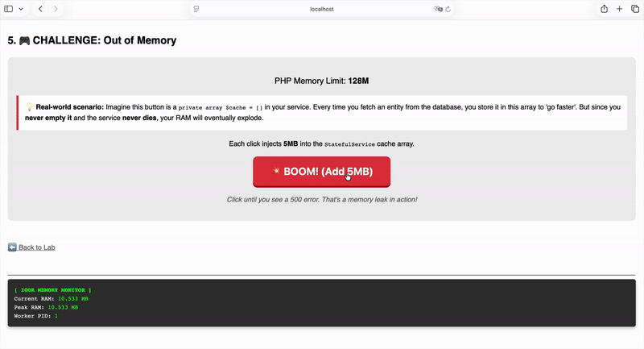
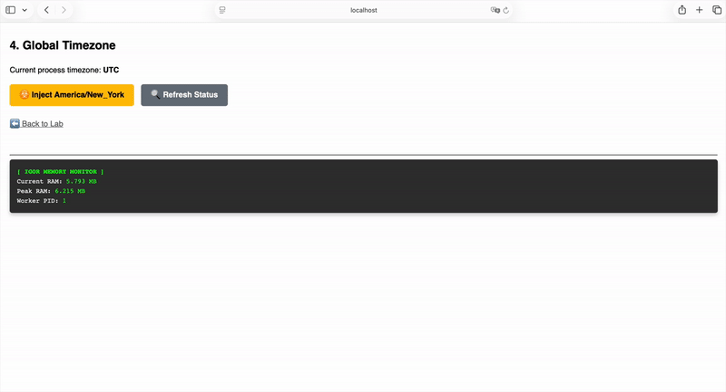
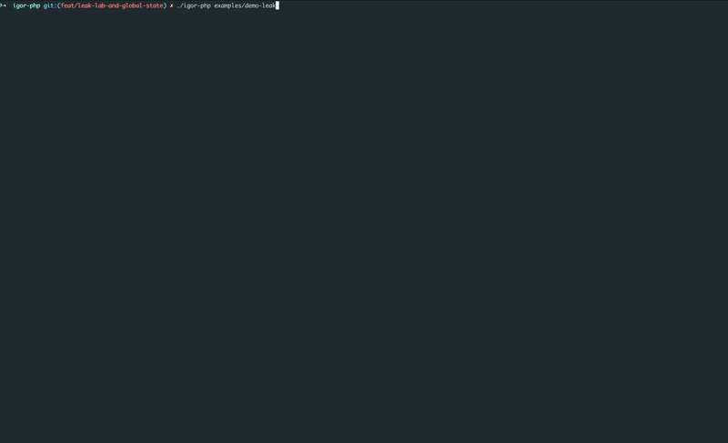
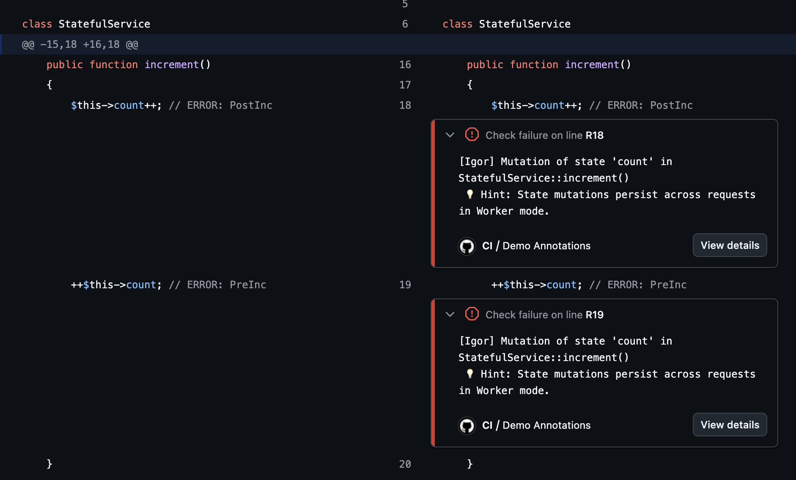

# 🧟‍♂️⚡ Igor-Php 
<p align="center">
  
</p>

<p align="center">
  <a href="https://github.com/igor-php/igor-php/actions/workflows/ci.yml">
    
  </a>
  <a href="https://codecov.io/gh/igor-php/igor-php">
    
  </a>
  <a href="https://packagist.org/packages/igor-php/igor-php">
    
  </a>
</p>

**The faithful assistant for your FrankenPHP Workers.**

⭐️ **If you find Igor useful, please consider leaving a star! It encourages us to keep maintaining and improving the project.**

`igor-php` is an ultra-fast static linter written in **Go** that prepares your **Symfony** application for the persistent memory model of **FrankenPHP**.

Like the legendary assistant, `igor` checks every connection and part of your application to ensure it won't "blow up" when the lightning strikes (Worker Mode).

---

## ✨ Highlights

- **⚡ Lightning Fast**: Scans hundreds of files in milliseconds using Go's native multi-threading.
- **🔍 Deep Audit**: Automatically detects Symfony projects and audits **every shared service** defined in the container, including those in `vendor/` and external bundles.
- **🎯 Surgical Precision**: Detects complex state mutations (`$this->prop[]`, `static::$prop`, increments) without false positives.
- **🧠 Intelligent**: Verifies not just the presence of `ResetInterface`, but ensures all mutated properties are correctly reset. Automatically ignores **`readonly` properties and classes** (PHP 8.1+) as they are immutable by design.
- **🛡️ Safety First**: Catches dangerous `exit()` or `die()` calls, and warns about **PHP Superglobals** (`$_GET`, `$_POST`, etc.) or **local static variables** that could leak state between requests.
- **🔇 Zero Noise**: Automatically ignores `Symfony\` and `Doctrine\` namespaces, and common data folders (`Entity`, `Dto`, `ApiResource`).
- **📦 Project vs. Vendor**: Clear separation between your code and third-party dependencies, with tailored recommendations for each.
- **🎯 Reachability Ranking**: Cross-references every flagged mutator against your own call graph. Findings actually reachable from your application code are tagged `[HIGH]` and surface first; findings with no call site found are tagged `[INFO]`.
- **🎯 Selective Ignore**: Skip specific lines using the `// @igor-ignore` comment, or target entire classes, methods, and properties using modern **PHP 8 Attributes** (`#[WorkerSafe]`).
- Bridge-Agnostic Bridge**: Not on Symfony? Feed Igor your container's service graph via `--container-dump <file.json>` so it skips transient (non-shared) value objects and per-request helpers — the same precision the Symfony bridge gives, for **any** framework (Laravel, Laminas, …).

---

## 🔍 What Igor Tracks

During its static analysis of shared/singleton services, Igor recursively scans the AST to detect and flag several dangerous patterns that can lead to memory leaks or state pollution across requests:

| Category | Pattern / Rule | Description | Impact Level | Code Example |
| :--- | :--- | :--- | :---: | :--- |
| **Dependency Mutation** | `DetectSingletonMutation` | Calling mutation methods (starting with `set`, `add`, `push`, `register`, `append`, `disable`, `enable`, `clear`, `remove`) on injected properties, chained method calls, or local references of shared services (with smart alias tracking). | 🔴 Critical | `$this->googleTagManager->addPush($data);`<br>`$entityManager->getFilters()->disable('softdeleteable');` |
| **Resettable Bypass** | *(Bypass)* | Igor automatically resolves Symfony autowire aliases and abstract interface/implementation chains to see if the dependency is marked as resettable, and **ignores mutation warnings** on it. | 🟢 Safe (Auto) | `$this->translator->setLanguage($lang);`<br>*(if translator is resettable)* |
| **Closure State Leak** | `DetectClosureStateLeak` | Passing anonymous functions that capture local variables (`use ($var)`) to shared service dependencies. | 🔴 Critical | `$this->dispatcher->addListener('response', function () use ($optin) {});` |
| **Finally Cleanup** | *(Bypass)* | Igor natively detects when a mutated state is guaranteed to be cleaned up inside a `finally` block (using `array_pop`, `unset`, or direct assignments), and **automatically bypasses the error**. | 🟢 Safe (Auto) | `try { $this->stack[] = $item; } finally { array_pop($this->stack); }` |
| **State Mutation** | `StateMutation` | Direct assignment or mutation of class properties or static variables at runtime. | 🔴 Critical | `$this->count++;`<br>`self::$cache[] = $val;` |
| **Reset Interface** | `IncompleteReset` | Class implements `ResetInterface` but some of its mutated properties are not cleared inside `reset()`. | 🟡 Warning | `public function reset() {`<br>`  // forgot to clear $count`<br>`}` |
| **Process State Mutation** | `ProcessStateMutation` | Functions modifying global PHP configuration or runtime behavior that persist across requests. | 🟡 Warning | `date_default_timezone_set('UTC');`<br>`ini_set('memory_limit', '256M');` |
| **Local Static Variable** | `LocalStaticVariable` | Declaring local static variables inside methods, which persist across the PHP process lifecycle. | 🔴 Critical | `static $counter = 0;` |
| **PHP Superglobals** | `SuperglobalsUsage` | Direct access to legacy superglobals instead of injecting or using the framework's Request object. | 🟡 Warning | `$_GET['id']` or `$_POST['name']` |
| **Process Termination** | `ExecutionTerminator` | Standard PHP termination statements that crash the persistent worker. | 🔴 Critical | `exit()` or `die()` |
| **Shared Service Lifecycle** | `MagicMethodDestruct` | Declaring `__destruct()` magic method on shared/singleton services. | 🔴 Critical | `public function __destruct() { ... }` |

> 💡 **Philosophy & False Positives**:
> Igor's primary mission is to shield you as much as possible from dangerous code patterns that can pollute state or leak memory in persistent worker environments.
>
> To achieve this, Igor is deliberately strict: **we chose to report as many potential issues as possible** to guide your eyes to where things might go wrong. Consequently, Igor may occasionally raise false positives. It remains your responsibility to analyze Igor's findings and decide if they can be safely ignored (e.g., using `// @igor-ignore` or the `#[WorkerSafe]` attribute).
>
> **Pro-Tip**: Enabling the **Symfony Bundle** dramatically reduces false positives. It grants Igor direct visibility into Symfony's compiled container, allowing it to bypass warnings for transient (non-shared) services and automatically ignore mutations on services marked as resettable (tagged with `kernel.reset`).
>
> **Smart Alias & Interface Resolution**: Igor is smart enough to traverse Symfony **aliases** and **interface-to-implementation autowire chains**. If your class property is type-hinted with an interface (e.g. `TranslatorInterface`), Igor will automatically resolve the alias chain in the container to find the concrete service definition (even if it uses decorated IDs like `.abstract.instanceof...`) to check if it's resettable, preventing false positive warnings.

> 🧠 **Smart Stack Cleanup (Finally Blocks)**:
> If your service manages temporary state using a stack or push/pop pattern (like Symfony's `AuthorizationChecker`), Igor is smart enough to scan `finally` clauses. If it detects that a mutated property is guaranteed to be restored or cleaned up inside the `finally` block (using `array_pop()`, `array_shift()`, `unset()`, or direct resets), the mutation is marked as safe and the warning is automatically bypassed.

> 🧠 **Infrastructure Taint Breakers**:
> Igor's taint-tracking is incredibly powerful, but mutating query-scoped objects or transient builders (like Doctrine Queries, QueryBuilders, Symfony's `ConstraintViolationBuilder` from `$this->context->buildViolation(...)`, or PSR-6 cache items via `$this->cache->getItem(...)`) is completely safe. Igor has built-in **Taint Breakers** for these standard design patterns: any chained calls or assignments coming from methods starting with `find`, `create`, `build`, or calling `getItem`/`getItems` are recognized as transient/ephemeral. This automatically halts taint propagation and eliminates noise on your repositories, cache services, and validator classes.

---

## 📋 Prerequisites

- **Go**: Required to compile or install the binary.
- **PHP 8.1+**: Required for the **Deep Audit** mode. Igor uses PHP Reflection to precisely locate service files within your project and `vendor/` directory. Without PHP, Igor will fall back to a standard directory scan.

---

## 🚀 Installation

### Via Composer (Recommended)
```bash
composer require --dev igor-php/igor-php
```

When running Igor, the included php bootstrapper will download the Go binary of Igor in the version matching the installed composer-package version.  
You can override this behavior by setting the `IGOR_VERSION` environment variable to a version string (i.e. `0.8.9`) to use a specific version or to `latest` to always get the latest version.

In case your `autoload.php` is not in the standard location `vendor/autoload.php` you have to set it via the `IGOR_AUTOLOAD_LOCATION` environment variable.

### Enable the Symfony Bundle (Optional but Recommended)
To make Igor even more reliable, you can enable the embedded PHP bundle. It generates a precise service map directly from your container, which Igor Go will use to audit your services.

Add the bundle to your `config/bundles.php`:

```php
return [
    // ...
    IgorPhp\IgorBundle\IgorPhpBundle::class => ['dev' => true, 'test' => true],
];
```

Or manually in your `Kernel.php`:

```php
public function registerBundles(): iterable
{
    // ...
    if ($this->getEnvironment() === 'dev') {
        yield new IgorPhp\IgorBundle\IgorPhpBundle();
    }
}
```

### Via Go
```bash
go install github.com/igor-php/igor-php@latest
```

---

## 🛠️ Usage

### 🪄 Quick Start
Igor can automatically detect your project type Symfony and generate a default configuration for you:

```bash
# Initialize igor.json
igor-php init

# Initialize with a custom name/path
igor-php init -c custom-igor.json
```

### 🔍 Audit your project
Once initialized (or using defaults), let Igor audit your project:

```bash
# Standard usage
igor-php .

# Generate a baseline to ignore existing errors
igor-php --generate-baseline .

# Custom configuration file
igor-php --config custom-igor.json .
# or shorthand
igor-php -c custom-igor.json .

# Custom console path, environment and verbose mode
igor-php --console app/console --env stage --verbose .

# Non-Symfony project or skip Symfony discovery
igor-php --no-agent .
```

### 🧠 Semantic Explanation Matrix (Diagnostic Mode)
If you want to understand the exact sémantique and diagnostic criteria that led Igor to flag or approve a service, you can run the `explain` command:

```bash
# Display diagnostic matrix for all services
igor explain .

# Filter the matrix on a specific class or file name (case-insensitive)
igor explain . SuperService
```

This prints a tabular matrix summarizing which rules (`Static` mutations, `Term` terminators, `Super` globals, or `Leak` closure captures) are triggered on each class, alongside a detailed diagnosis explaining why each class is either safe (`✅ OK`) or dangerous (`❌ KO`):

```text
🔍 Igor Explanation Matrix - Services Audit Diagnoses
=====================================================

+-----------------------------------------+--------+--------+-------+-------+-------+-------------------------+
| Service Class                           | Shared | Static | Term  | Super | Leak  | Verdict                 |
+-----------------------------------------+--------+--------+-------+-------+-------+-------------------------+
| App\Service\StatefulService             | YES    | NO     | NO    | NO    | NO    | ❌ KO (State Mutation)  |
| App\Service\LocalStaticService          | YES    | YES    | NO    | NO    | NO    | ❌ KO (State Poison)    |
| App\Controller\LeakDemoController       | YES    | YES    | YES   | YES   | YES   | ❌ KO (State Poison)    |
| App\Service\TracerLeakDemoService       | YES    | NO     | NO    | NO    | NO    | ✅ OK (Stateless)       |
+-----------------------------------------+--------+--------+-------+-------+-------+-------------------------+
```

It fully loads and respects local and external baselines, allowing you to debug exactly why your active findings occur.

### 🛡️ Baseline Management

In legacy projects or during initial integration, you might want to ignore existing findings to prevent CI pipeline failures and focus on new code. Igor supports baseline files with advanced checking and cleaning commands.

#### 1. Generating a baseline
To create a baseline of all currently detected findings:
```bash
igor-php --generate-baseline .
```
This generates an `igor-baseline.json` file (or writes to the file path specified by `--baseline`). Each ignored entry has a `reason` field pre-filled with a default comment. We highly encourage developers to document why an exclusion is a false positive or safe rather than just hiding alerts:
```json
{
  "files": {
    "src/Service/MyService.php": [
      {
        "message": "Mutation of state 'static::$cache' in MyService::cache()",
        "reason": "TODO: Explain why this state mutation is a false positive or safe"
      }
    ]
  }
}
```

#### 2. Checking baseline freshness (CI integration)
Over time, files get refactored, fixed, or deleted. To ensure your baseline doesn't become a graveyard of obsolete rules, run the check command:
```bash
igor-php --check-baseline .
```
- If any baseline entries are **no longer detected** in the scanned files, Igor will report them as stale and exit with **code 1**.
- If the baseline is clean and perfectly up-to-date, it exits with **code 0**.

#### 3. Automatically pruning stale baseline entries
To automatically clean up your baseline by removing all stale/obsolete entries:
```bash
igor-php --prune-baseline .
```
This will rewrite `igor-baseline.json` (or your custom baseline path) on disk, removing any rules that are no longer active, keeping your configuration neat and relevant.

### Non-Symfony Projects
Igor can also audit standard PHP projects that don't use the Symfony framework. In this case, use the `--no-agent` flag to disable automatic container discovery.

When using Igor without Symfony, you should manually define which directories or vendor packages to audit in your `igor.json`:

```json
{
  "scan_vendors": ["my-company/internal-library"],
  "exclude": ["tests", "Data", "vendor/symfony"]
}
```

> 💡 **Note**: Without Symfony, Igor performs a recursive scan of your project directory (excluding folders in `exclude`). Using `scan_vendors` allows you to force the audit of specific third-party libraries even without the Symfony service map.

### 🌉 Generic Container Bridge (`--container-dump`)

Frameworks with their **own DI container** can give Igor the same signal the Symfony bridge provides: which classes are real **shared services** versus **transient** ones (per-request value objects, per-resolution helpers). Without it, a plain directory scan flags legitimate mutators on immutable-by-design value objects (PSR-7 `Uri`/`Stream`/`Message`, PSR-6 `CacheItem`, …) as state leaks.

Export your container's graph to a framework-agnostic JSON file and pass it with `--container-dump`:

```json
{
  "services": [
    { "class": "App\\Http\\Uri", "shared": false },
    { "class": "App\\Cache\\CacheItem", "shared": false },
    { "class": "App\\Service\\MailService", "shared": true }
  ],
  "aliases": {
    "App\\Contract\\MailerInterface": "App\\Service\\MailService"
  }
}
```

```bash
igor-php --no-agent --container-dump igor-container.json .
```

By convention, keep `igor-container.json` at the project root, side-by-side with `igor.json`. Any class listed with `"shared": false` is treated as transient and its state mutations are **skipped** — exactly as the Symfony bridge already skips non-shared (prototype) services. Classes marked `"shared": true`, or absent from the file, continue to be audited normally. The optional `"aliases"` map tells Igor which interface FQCN resolves to which concrete class, so reachability ranking can follow calls made through an interface type-hint. You can also set the path in `igor.json` via `"container_dump": "igor-container.json"`.

> 💡 The format is intentionally minimal so **any** framework can produce it (Laravel, Laminas, …). Symfony's `igor_service_map.json` is simply one richer producer of the same idea.
>
> If you **generate** this file from a framework command rather than committing it, a gitignored build path (e.g. `var/igor-container.json`) is also fine — just regenerate it in CI before running Igor, the same way the Symfony agent map is warmed up.

## 🌉 Community Bridges

Igor's core stays framework-agnostic — the Symfony bundle and the generic `--container-dump` contract are all the engine needs. Anyone can ship a thin **bridge** that produces that signal for their own framework. Community-maintained bridges:

| Framework | Bridge | Notes |
|-----------|--------|-------|
| **Waffle** | [waffle-commons](https://github.com/waffle-commons) | Emits a `--container-dump` service map and adopts Igor's `#[WorkerSafe]` attribute for FrankenPHP worker-mode state audits. |

> Maintain a bridge for another framework? Open a PR adding a row — the only contract is the `--container-dump` JSON shape shown above.

## 🧪 See it in Action

Want to understand why Igor is vital for your Worker environment? Check these real-world scenarios from our **Leak Lab**:

| **1. Memory Pressure (The "BOOM" effect)** | **2. Global State Poisoning** |
|:---:|:---:|
|  |  |
| *Adding data to a shared service without reset will accumulate in RAM until the worker crashes.* | *Modifying global PHP settings (like timezone) "poisons" the worker thread for all future requests.* |

### 🛡️ Igor's Verdict: Catching them all in < 1s

*Igor identifies all leaks (Static, Stateful, Incomplete Reset) and dangerous global function calls automatically.*

---

### 🧪 Try the Leak Lab yourself!
We've built an **interactive laboratory** using Symfony and FrankenPHP. You can run it locally with Docker and see the memory leaks with your own eyes.

[**Explore the Igor Leak Lab →**](examples/demo-leak/README.md)
---

### Deep Audit Mode (Symfony)
When a Symfony project is detected, Igor combines three layers of discovery to ensure maximum reliability:

1.  **Level 1: Project Code (Recursive Scan)**: Igor scans all PHP files in your project directory (excluding `vendor`, `var`, `tests`, etc.). This ensures that even if Symfony "inlines" or "hides" a service for optimization, Igor will still find and audit it.
2.  **Level 2: Smart Filtering (Composer)**: Igor automatically parses your `composer.json`, `composer.lock`, and `installed.json` to identify all development packages (both direct in `require-dev` and transitive dependencies like `fakerphp/faker`). It automatically excludes any service originating from these packages to reduce noise and focus only on production-ready code.
3.  **Level 3: Igor Agent (Embedded Bundle)**: By enabling the optional PHP bundle, Igor becomes "infallible". The bundle hooks into the Symfony compilation process to export the exact map of all active shared services.

---

## 🧠 How it Works

### 1. Smart Filtering
Igor inspects your Composer dependencies across `composer.json`, `composer.lock` (`packages-dev`), and `vendor/composer/installed.json` (`dev-package-names`). When it audits your Symfony container, it checks the physical path of each service. If a service is located inside a `vendor/` directory belonging to a direct or transitive dev package (like `phpunit/phpunit`, `symfony/maker-bundle`, or `fakerphp/faker`), Igor will automatically skip it. Packages required by production dependencies are never excluded.

### 2. Igor Agent (The PHP Bundle)
The `IgorPhpBundle` includes a `CompilerPass` that runs every time you clear your Symfony cache (`php bin/console cache:clear`).

> ⚠️ **Important**: You must run `php bin/console cache:clear` whenever you add or modify services in your Symfony project to ensure the Igor Agent map is up-to-date.

- **What it does**: It iterates through the `ContainerBuilder`, identifies all **Shared Services**, and extracts their class names and IDs.
- **The Cache**: It writes this information into a small JSON file: `var/cache/<env>/igor_service_map.json`.
- **The Benefit**: The Go binary reads this file instead of executing the heavy `debug:container` command. This makes the audit launch near-instant and ensures 100% accuracy, even for services added by complex compiler passes or decorators.

#### Example `igor_service_map.json`:
```json
{
    "definitions": {
        "app.mail_service": {
            "class": "App\\Service\\MailService",
            "public": true,
            "shared": true
        },
        "logger": {
            "class": "Monolog\\Logger",
            "public": true,
            "shared": true
        }
    },
    "aliases": {
        "Psr\\Log\\LoggerInterface": "logger"
    }
}
```

### 3. Semantic Return-Type Tracking (Transient Analysis)
To prevent false positives on ephemeral objects (like OpenTelemetry Spans or Transient DTOs) returned by your shared services, Igor transitions from purely lexical checks (guessing based on method names) to **semantic type tracking**:

- **Method Signature Parsing**: On the first call to any method on a service class, Igor locates the class's source file and parses its AST using Tree-Sitter to extract the declared PHP return types (including `self`, `static`, or nullable types) and resolves relative namespaces.
- **Fast O(1) In-Memory Cache**: This extraction runs only once per class. The signatures are stored in a double-keyed in-memory map to guarantee lightning-fast diagnostics with zero disk I/O overhead on subsequent calls.
- **Local Variable Type Propagation**: Igor tracks the types of local variables through assignment operations (e.g. `$span = $this->tracer->makeSpan();`).
- **Transient vs. Shared Evaluation**: Igor then checks if the resolved return type represents a shared singleton service registered in the Symfony container.
  - If the type is **NOT** a shared service (e.g., `Span`), Igor classifies it as a **transient/ephemeral object**.
  - Subsequent mutations on this variable (e.g., `$span->setAttribute('key', 'value')`) are deemed **100% safe** and bypassed, ensuring zero false positives on safe request-scoped data.
  - If the return type is indeed a shared service (e.g., a shared `EntityManager`), mutations remain strictly protected.

### 4. Call-Site Reachability Ranking
Not every flagged mutator matters equally: a setter on a vendor class might never be called anywhere in your application, while another is hit on every request. Igor ranks findings accordingly:

- **Call-Graph Construction**: While auditing each file, Igor records a call-graph edge for every method call whose receiver resolves to a known class — including `$this->service->method()` chains and internal `$this->otherMethod()` self-calls.
- **BFS from Application Code**: Igor walks this graph starting from every method declared in your own project files (not `vendor/`), following calls transitively (e.g. `Controller::action()` → `Service::doWork()` → `VendorClass::mutate()`).
- **Ranking**: Each finding is tagged `[HIGH]` if its method is reachable from this walk, or `[INFO]` if no call site was found anywhere in the audited codebase. `[HIGH]` findings are printed first within each file so the actionable bugs surface before the noise.

```text
📂 vendor/knp/snappy/src/Knp/Snappy/AbstractGenerator.php
  [VENDOR] [HIGH] Mutation of state 'temporaryFiles' in AbstractGenerator::createTemporaryFile()
  513 | $this->temporaryFiles[] = $filename;

  [VENDOR] [INFO] Mutation of state 'binary' in AbstractGenerator::setBinary()
  275 | $this->binary = $binary;
```

> 💡 **Known limitation**: reachability matching works on exact `Class::Method` pairs. Igor conservatively follows direct and multi-level `extends` chains — a subclass that inherits, but doesn't override, a flagged parent method is linked through to the parent's finding, and an override correctly stops that promotion at the overriding class. It also follows interface aliases from the Symfony agent map or `--container-dump`, so a call through an interface type-hint is linked to the concrete implementation. It does **not** follow traits or magic methods (`__call`, `__get`, etc.), so a call resolved only through one of those still won't be linked through. Treat `[INFO]` as "no call site found *with this analysis*", not an absolute guarantee of dead code.

---

## ⚙️ Configuration

You can customize Igor's behavior by creating an `igor.json` file at the root of your project:

```json
{
  "exclude": ["vendor", "tests", "Entity"],
  "safe_namespaces": ["Symfony\\", "Doctrine\\", "Psr\\", "Twig\\", "IgorPhp\\IgorBundle\\"],
  "scan_vendors": ["my-company/internal-bundle"],
  "ignore_vendors": false,
  "baseline": "igor-baseline.json",
  "ignore_external_baseline": false,
  "container_dump": "igor-container.json",
  "console_path": "bin/console",
  "env": "dev",
  "verbose": false
}
```

- **exclude**: List of directories to skip during indexing.
- **safe_namespaces**: Igor will ignore state mutations in classes starting with these prefixes (defaults: `Symfony\`, `Doctrine\`, `Psr\`, `Twig\`, `IgorPhp\IgorBundle\`).
- **scan_vendors**: List of sub-directories within `vendor/` to scan recursively.
- **ignore_vendors**: Set to `true` to skip auditing all services located within the `vendor/` directory. Defaults to `false`.
- **baseline**: Path to a baseline file containing findings to ignore.
- **ignore_external_baseline**: Set to `true` to skip discovering and merging baseline files from external vendor packages. Defaults to `false`.
- **container_dump**: Path to a generic container dump JSON (`{ "services": [ { "class": ..., "shared": bool } ], "aliases": { "Interface": "ConcreteClass" } }`) listing non-shared/transient classes to skip and optional interface-to-implementation aliases for reachability. Equivalent to the `--container-dump` flag.
- **console_path**: Custom path to the Symfony console binary. Defaults to `bin/console`.
- **env**: Symfony environment to use for container analysis. Defaults to `dev`.
- **verbose**: Enable verbose output to see skipped services and reasons. Defaults to `false`.

### 🛡️ Baselines & External Vendor Baselines

When you first adopt Igor, you might want to grandfather in existing technical debt by generating a baseline file:

```bash
# Generate a baseline file (default name: igor-baseline.json)
igor-php --generate-baseline .
```

Subsequent audits will ignore findings present in this baseline file.

#### Support for External Vendor Baselines
If your project depends on other local packages or vendor dependencies that also manage their technical debt with `igor-php`, Igor will **automatically discover, translate, and merge** their baselines into the audit!

- **Auto-Discovery & Nested Search**: Igor scans all packages inside `vendor/`. If a vendor package contains an `igor.json` with a custom `baseline` path, or has a default `igor-baseline.json` file, Igor automatically detects it. It natively supports configurations located at the package root or in common nested directories (such as `config/`, `config/ci/`, and `.github/`).
- **Container/Docker Absolute Path Fallback**: If an external configuration specifies an absolute baseline path (e.g., `/app/config/ci/igor-baseline.json` from a containerized CI environment) that does not exist on the host machine, Igor dynamically evaluates and resolves the longest matching suffix under the package directory to locate and load the correct file.
- **Path Translation**: Igor translates the relative paths within the vendor baseline (e.g., `src/Service.php` in the package) into the context of the parent project (e.g., `vendor/acme/package1/src/Service.php`).
- **Seamless Merging**: These translated paths are merged on the fly into the active baseline, meaning you won't have to manually copy-paste external baseline entries into your project's baseline!
- **Symlink Support**: If a local vendor package is installed as a symbolic link (e.g., via Composer's `path` repository type under development), Igor automatically detects the symlink, follows its target to discover the baseline, and maps analyzed file paths back to their vendor-relative equivalents (`vendor/acme/my-bundle/...`).

#### 🔍 Debugging Discovered External Baselines
To list all discovered vendor baselines, check their type (regular file vs. symbolic link), and inspect all ignored rules along with their documented reasons, run the debug subcommand:

```bash
igor-php debug-external-baseline [directory]
```

This will print a clean tree structure of all active external baselines:

```text
🔍 Debugging external baselines for project at: /Users/thomas/projects/my-project

🛡️  Found regular external baseline for package acme/package1 at: /Users/thomas/projects/my-project/vendor/acme/package1/igor-baseline.json (1 files ignored)
🛡️  Found symlinked external baseline for package acme/package3 at: /Users/thomas/projects/local-packages/package3/igor-baseline.json (1 files ignored)
🛡️  Loaded 2 external baseline paths from vendor dependencies.

📋 Summary of loaded baseline files:
   - vendor/acme/package1/src/Service1.php (1 rules ignored)
       • State mutation detected in Service1
           ◦ Reason: Legacy code needing refactor
   - vendor/acme/package3/src/Service3.php (1 rules ignored)
       • State mutation detected in Service3
```

If you want to disable this behavior and only apply your root project's baseline:

```bash
# Ignore baselines from vendor dependencies
igor-php --ignore-external-baseline .
```

You can also set this permanently in `igor.json`:

```json
{
  "ignore_external_baseline": true
}
```

💡 RECOMMENDATIONS:
  [PROJECT] Since this is your code, you should refactor these services to be stateless
  or implement ResetInterface to clear the state between requests.
  [VENDOR]  This is third-party code. If you can't fix it, consider setting a 'max_requests' limit
  in your Worker configuration to mitigate memory leaks.

---

## 🧠 LLM Review & Triage

Igor can export findings in a structured JSON format and help you triage them using an LLM. This is particularly useful for distinguishing between harmless state (e.g., caches) and dangerous data leaks.

### 1. Frictionless Mode (No API key needed)
Generate a ready-to-use prompt for your favorite LLM (ChatGPT, Claude, etc.):

```bash
# 1. Export the audit to JSON
igor-php --output llm . > audit.json

# 2. Generate the review prompt
igor-php review audit.json
```
Igor will create `igor-review-prompt.md`. Simply copy its content into an LLM to get a detailed security analysis and remediation plan.

### 2. Expert Mode (Automatic)
Configure Igor to call an LLM directly by updating your `igor.json`:

#### Option A: Using Gemini CLI (Recommended if installed)
If you have `gemini-cli` installed and configured, Igor can use it directly:
```json
{
  "llm": {
    "provider": "gemini",
    "model": "gemini-1.5-pro"
  }
}
```

#### Option B: Using Ollama (Local LLM)
If you run Ollama locally, Igor can use its OpenAI-compatible endpoint. This is great for privacy, but **please note that triage quality depends heavily on the model size.** Smaller local models (like Llama 3 8B) are significantly less capable than large online models for complex security triage.

```json
{
  "llm": {
    "provider": "ollama",
    "model": "llama3" 
  }
}
```
*Note: Igor defaults the `api_url` to `http://localhost:11434/v1` for Ollama.*

#### Option C: OpenAI-Compatible API
```json
{
  "llm": {
    "provider": "openai",
    "api_url": "https://api.openai.com/v1",
    "api_key_env": "OPENAI_API_KEY",
    "model": "gpt-4o"
  }
}
```

Then run:
```bash
# For Option C, ensure the API key is set
export OPENAI_API_KEY=your_secret_key

igor-php review audit.json
```
Igor will automatically send the audit to the LLM and save the report to `igor-review.md`.

---

### Selective Ignoring (Comments & Attributes)

#### 1. Line-by-Line Exclusions
If you have a specific line that you know is safe, you can use the `// @igor-ignore` annotation:

```php
// @igor-ignore
$this->cache = $data; // This line will be ignored

$this->counter++; // @igor-ignore - This line too
```

#### 2. Modern Exclusions with PHP 8 Attributes (Recommended)
Instead of line-by-line comments, you can use modern PHP 8 attributes to exclude entire classes, specific methods, or individual properties.

First, import the attribute (available via the embedded Symfony bundle):
```php
use IgorPhp\IgorBundle\Attribute\WorkerSafe;
```

Then decorate your code elements:

*   **Class-level**: Ignore all state leak and mutation findings within the entire class.
    ```php
    #[WorkerSafe(scope: 'boot-time', reason: 'Configuration is frozen after warmup')]
    class MyService {
        // All mutations and state checks inside this class are ignored
    }
    ```

*   **Method-level**: Ignore state mutations occurring inside a specific method.
    ```php
    class MyService {
        #[WorkerSafe]
        public function warmUp() {
            $this->cache = ['foo' => 'bar']; // This mutation is ignored
        }
    }
    ```

*   **Property-level**: Ignore all mutations on a specific property and exclude it from the `ResetInterface` verification. Works flawlessly with both standard and constructor-promoted properties!
    ```php
    class MyService {
        #[WorkerSafe]
        private $cache = []; // Mutations and missing reset checks are ignored
        
        public function __construct(
            #[WorkerSafe]
            private StatefulService $safeService, // Promoted property is safe!
        ) {}
    }
    ```

---

## 🔍 Understanding Deep Audit Filtering

When using the **Deep Audit** mode (Symfony), Igor might analyze fewer services than your total container count. Use the `--verbose` flag to see exactly why a service was skipped. Common reasons include:

- **🔄 Duplicate File**: Multiple Service IDs (aliases, locators, etc.) pointing to the same PHP file. Igor only audits each unique file once.
- **♻️ Non-shared (Prototype)**: Services marked as `shared: false` are recreated on every request and don't persist state between workers. They are safe by design.
- **λ Closures / Synthetic**: Services that don't map to a physical PHP class (like Closures or synthetic services) cannot be statically analyzed.
- **🛡️ Safe Namespace**: The class belongs to a namespace defined in `safe_namespaces` (like `Symfony\`, `Doctrine\`, or `Twig\`).

> 💡 **Pro Tip**: If you notice **Entities, DTOs, or Data Models** appearing in the Igor audit, it means they are registered as "Shared Services" in your Symfony container. This is usually a configuration error in your `services.yaml`. You should exclude these directories from autowiring:
>
> ```yaml
> # config/services.yaml
> services:
>     App\:
>         resource: '../src/'
>         exclude:
>             - '../src/Entity/'
>             - '../src/Dto/'
>             - '../src/Kernel.php'
> ```

---

## 🤖 CI/CD Integration

Igor is designed to work out-of-the-box in your CI pipelines. It will exit with **code 1** if any error is found, effectively stopping your build.

### GitHub Actions support
When running inside GitHub Actions, Igor automatically generates **inline annotations**. This means errors will appear directly in your Pull Request review, right next to the code causing the issue.

<p align="center">
  
</p>

### GitHub Actions Example

```yaml
name: Static Analysis
on: [push, pull_request]

jobs:
  igor:
    runs-on: ubuntu-latest
    steps:
      - uses: actions/checkout@v4

      - name: Setup PHP
        uses: shivammathur/setup-php@v2
        with:
          php-version: '8.3'

      - name: Install Dependencies
        run: composer install --no-progress --prefer-dist

      - name: Warmup Symfony Cache (for Deep Audit)
        run: php bin/console cache:warmup --env=dev

      - name: Run Igor Audit
        run: vendor/bin/igor-php .
```

---

## 🙏 Credits & Inspirations

- **[Phanalist](https://github.com/denzyldick/phanalist)**: Special thanks to `phanalist` and its rule `E0012` (Stateful Service) which inspired Igor's core mutation detection logic.
- **[Gemini CLI](https://github.com/google/gemini-cli)**: This project was built with the help of Gemini CLI.
- **[FrankenPHP](https://frankenphp.dev/)**: For the amazing server that makes these checks necessary!

---

## 🤝 Contributing

We welcome contributions of all kinds! Please refer to our **[CONTRIBUTING.md](./CONTRIBUTING.md)** guide for instructions on how to set up the project, run tests, and validate your changes using either **native tools** or **Docker**.

---

## 📄 License
MIT
